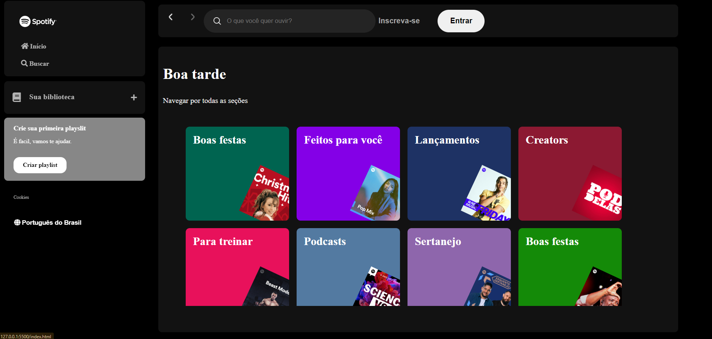

# Alura Spotify

Project made in five days of Alura event
## Table of contents

- [Overview](#overview)
  - [The challenge](#the-challenge)
  - [Screenshot](#screenshot)
  - [Links](#links)
- [My process](#my-process)
  - [Built with](#built-with)
  - [What I learned](#what-i-learned)
  - [Continued development](#continued-development)
  - [Useful resources](#useful-resources)
- [Author](#author)

## Overview

A project challenged by [Alura](https://cursos.alura.com.br/imersao)

### The challenge

Users should be able to:

- Create Spotify page

    - using semantic tags
    - using css variables and media query;
    - filter tags by using DOM event

### Screenshot

### Links

- Solution URL: [GitHub respository](https://github.com/ViniCellist/Alura-Spotify)

## My process

All the process I followed in Alura

### Built with

- HTML5
- CSS3
    - Flexbox
    - Media Query
- JavaScript
- JSON API

### What I learned

I learned good softskills from the instructors...they shared lots of experience, such as:
- organization
- visualization

### Continued development

Keep my focus on becoming a fullstack Dev...

### Useful resources

- [HTML](https://developer.mozilla.org/en-US/docs/Web) 
- [CSS](https://developer.mozilla.org/en-US/docs/Web/CSS)
- [JavaScript](https://developer.mozilla.org/en-US/docs/Web/JavaScript)
- [JSON](https://developer.mozilla.org/en-US/docs/Learn/JavaScript/Objects/JSON)

## Author

- GitHub - [Personal Profile](https://github.com/ViniCellist)
- LinkedIn - [Professional Profile](https://www.linkedin.com/in/vinicius-de-souza-duarte-57937b192/)
- Instagram - [Personal Profile](https://www.instagram.com/vinicius_duartesd/)